# Deterministic Alternative Root Name Space
## High-Level Technical Specification and Initial Implementation Logic

**License:** GNU General Public License v3.0  
**Classification:** Academic / Technical Research  
**Author role:** Senior Network Engineer & Cryptographic Systems Architect  
**Revision:** 1.0.0

---

## Abstract

This document specifies the architecture, cryptographic foundations, and operational logic for a Private Alternative Root Name Space (ALT-ROOT-NS) that operates independently of ICANN's delegated root zone. The system combines Deterministic Domain Generation (DGA) via hexadecimal arithmetic, a privately administered authoritative root cluster (BIND9 / PowerDNS), a multi-format Hex-to-IP translation layer, and a zero-identity peer-to-peer gossip protocol for root-hint synchronization. All components are designed to be cryptographically verifiable but computationally opaque to parties not in possession of the domain generation map.

---

## 1. System Design Principles

| Principle | Implementation |
|---|---|
| Zero-Identity Administration | No registrant data; domains are deterministically derived artifacts |
| Cryptographic Verifiability | Every domain string and hint bundle is Ed25519-signed |
| Determinism | Given identical (seed, constant, index), output is always identical |
| Opacity | Without the seed map, the domain list is computationally indistinguishable from random |
| Independence | No ICANN root servers consulted; no public TLDs used |

---

## 2. Component 1 — Deterministic Domain Generation (DGA)

### 2.1 Design Rationale

Domains in this namespace are not registered; they are _derived_. The derivation function is a one-way mapping from a high-entropy shared secret combined with a mathematical constant. Anyone holding the seed map can reproduce and verify the full domain list. Anyone without it cannot enumerate or predict it.



### 2.2 Cryptographic Seed Construction

The seed is a 512-bit value produced by:

```
seed = SHA3-512( master_secret || timestamp_epoch || node_id )
```

Where:
- `master_secret` — a 256-bit value distributed out-of-band to the closed user group (e.g., via a sealed QR payload or hardware token).
- `timestamp_epoch` — an agreed rotation epoch (e.g., Unix epoch truncated to the nearest 30-day window), enabling key rotation without re-architecture.
- `node_id` — an optional 64-bit namespace discriminator, allowing multiple isolated namespaces from the same master secret.

The inclusion of `π` (Pi) as a mathematical constant serves as a public, reproducible, non-secret stretching factor — its irrationality ensures the output stream is non-repeating and dense.

### 2.3 Domain Generation Formula

```python
# SPDX-License-Identifier: GPL-3.0-or-later
# Deterministic Domain Generator — Core Function
# Copyright (C) 2025  Alt-Root Research Project

import hashlib
import math

PI_HEX = hex(int(math.pi * (16 ** 16)))[2:]  # First 16 hex digits of Pi's fractional part

def generate_domain(seed_hex: str, index: int, tld: str = "void") -> str:
    """
    Derive a deterministic domain label for a given index.

    Args:
        seed_hex: 128-character hex string (512-bit seed).
        index:    Integer domain index (0 to 2^32-1).
        tld:      Private TLD string, e.g. 'void' or 'pican'.

    Returns:
        A fully-qualified domain string, e.g. 'a3f7b2c1.void'.

    The function is deterministic: identical inputs always produce identical output.
    Without seed_hex, reversing the label to the index is computationally infeasible
    (pre-image resistance of SHA3-256).
    """
    # Step 1: Mix seed with Pi-derived constant and the requested index
    index_hex = f"{index:08x}"                          # 32-bit index, zero-padded
    mix_input = seed_hex + PI_HEX + index_hex

    # Step 2: Hash the mixture
    digest = hashlib.sha3_256(mix_input.encode()).hexdigest()

    # Step 3: Truncate to a human-readable hex label (8 hex chars = 32 bits of entropy)
    label = digest[:8]

    return f"{label}.{tld}"


def generate_domain_batch(seed_hex: str, start: int, count: int, tld: str = "void") -> list:
    """
    Generate a contiguous batch of domain strings.

    Returns:
        List of (index, domain) tuples.
    """
    return [(i, generate_domain(seed_hex, i, tld)) for i in range(start, start + count)]
```

**Example output** (for illustrative purposes only — actual values depend on secret seed):

```
Index 0 → a3f7b2c1.void
Index 1 → 9e4d0f82.void
Index 2 → c71a3b55.pican
```

**Security properties:**
- Pre-image resistant: given `a3f7b2c1.void`, recovering `seed_hex` requires inverting SHA3-256.
- Collision resistant: the probability of two distinct indices producing the same 8-char label is approximately 1 in 2^32 (~4 billion) per seed epoch.
- Enumeration resistance: a party without `seed_hex` cannot predict labels for unobserved indices.

---

## 3. Component 2 — Alternative Root (Alt-Root) Server Setup

### 3.1 Architecture Overview

The Alt-Root cluster consists of:

1. **One Master Root Server** — authoritative, hidden, signs zone with DNSSEC KSK.
2. **Two or more Secondary Root Servers** — receive AXFR/IXFR from master; serve recursive resolvers.
3. **Recursive Resolvers** — clients configure these via custom `named.cache` (Root Hints).

All servers run **BIND 9.18+** or **PowerDNS Authoritative 4.7+**. TSIG keys protect all zone transfers. DNSSEC uses **Ed25519** (algorithm 15) for both the KSK and ZSK.

### 3.2 BIND9 named.conf — Master Root Server

```
// SPDX-License-Identifier: GPL-3.0-or-later
// Alt-Root Master named.conf
// Copyright (C) 2025  Alt-Root Research Project

options {
    listen-on        { 127.0.0.1; 10.0.0.1; };     // Internal interfaces only
    listen-on-v6     { ::1; fd00::1; };
    directory        "/var/named";
    allow-query      { none; };                     // Master is hidden; no direct queries
    allow-transfer   { key "altroot-tsig"; };       // Secondaries only, TSIG-authenticated
    recursion        no;
    dnssec-validation no;                           // Master signs; does not validate upstream
    notify           yes;
};

key "altroot-tsig" {
    algorithm        hmac-sha256;
    secret           "<BASE64_TSIG_SECRET>";       // Generated: tsig-keygen altroot-tsig
};

zone "." {
    type             master;
    file             "/var/named/altroot.zone";
    allow-update     { none; };
    auto-dnssec      maintain;
    inline-signing   yes;
    key-directory    "/var/named/keys";
};

zone "void" {
    type             master;
    file             "/var/named/void.zone";
    allow-update     { none; };
    auto-dnssec      maintain;
    inline-signing   yes;
    key-directory    "/var/named/keys";
};

zone "pican" {
    type             master;
    file             "/var/named/pican.zone";
    allow-update     { none; };
    auto-dnssec      maintain;
    inline-signing   yes;
    key-directory    "/var/named/keys";
};
```

### 3.3 Custom Root Zone File (`altroot.zone`)

```
; SPDX-License-Identifier: GPL-3.0-or-later
; Alt-Root Custom Root Zone File
; Copyright (C) 2025  Alt-Root Research Project
;
; This file defines the apex of the private root zone.
; It delegates .void and .pican to authoritative name servers
; within the private namespace.

$TTL    86400
$ORIGIN .

; SOA — the master root server is authoritative for the root
@       IN  SOA     ns1.altroot.internal. hostmaster.altroot.internal. (
                    2025010101  ; Serial (date-based: YYYYMMDDNN)
                    3600        ; Refresh
                    900         ; Retry
                    604800      ; Expire
                    300 )       ; Minimum TTL

; Root name server declarations
@       IN  NS      ns1.altroot.internal.
@       IN  NS      ns2.altroot.internal.

; Glue records for root name servers
ns1.altroot.internal.  IN  A       10.0.0.1
ns1.altroot.internal.  IN  AAAA    fd00::1
ns2.altroot.internal.  IN  A       10.0.0.2
ns2.altroot.internal.  IN  AAAA    fd00::2

; Delegation of private TLDs
void    IN  NS      ns1.altroot.internal.
void    IN  NS      ns2.altroot.internal.

pican   IN  NS      ns1.altroot.internal.
pican   IN  NS      ns2.altroot.internal.

; DS records for TLD zones (generated via: dnssec-dsfromkey -a SHA-256 Kvoid.+015+XXXXX.key)
; These are populated after DNSSEC key generation.
void    IN  DS      XXXXX 15 2 <SHA256_DIGEST_PLACEHOLDER>
pican   IN  DS      XXXXX 15 2 <SHA256_DIGEST_PLACEHOLDER>
```

### 3.4 Custom Root Hints File (`named.cache`)

The standard `named.cache` (root hints) shipped with BIND points to ICANN's 13 root server clusters. To override this for the private namespace, distribute a replacement file to all participating recursive resolvers.

```
; SPDX-License-Identifier: GPL-3.0-or-later
; Custom Root Hints — Alt-Root Private Namespace
; Copyright (C) 2025  Alt-Root Research Project
;
; INSTALLATION: Replace /var/named/named.ca (or named.cache) with this file.
; On BIND: set `hints "named.ca"` in the options block.
; This file REPLACES standard ICANN root hints for this resolver.
; The resolver will NOT be able to resolve public ICANN TLDs unless
; forwarding to an upstream public resolver is configured separately.

.                        3600000  IN  NS   ns1.altroot.internal.
.                        3600000  IN  NS   ns2.altroot.internal.

ns1.altroot.internal.    3600000  IN  A    10.0.0.1
ns1.altroot.internal.    3600000  IN  AAAA fd00::1
ns2.altroot.internal.    3600000  IN  A    10.0.0.2
ns2.altroot.internal.    3600000  IN  AAAA fd00::2
```

**Coexistence with ICANN:** If nodes must also resolve public domains, configure BIND's `view` mechanism or split-horizon forwarding so the private root hints apply only to `.void` and `.pican` queries, while all other queries forward to an upstream public resolver (e.g., `8.8.8.8`).

---

## 4. Component 3 — Multi-Format IP Mapping and Hex-to-IP Translation Layer

### 4.1 Design Overview

Each deterministically generated domain label (an 8-character hex string) is mapped to a network endpoint via a stateless, arithmetic translation function. The same 32-bit hex value can be interpreted as an IPv4 address, a segment of an IPv6 address, or seeded into an Ed25519 key pair to derive a Tor Onion v3 address. The translation type is determined by a _routing prefix_ prepended to the resource record at registration time.

### 4.2 Routing Prefix Convention

When a domain is registered into the zone file, its record includes a routing prefix tag embedded in a TXT record:

| Prefix | Endpoint Type | Format |
|---|---|---|
| `4:` | IPv4 | `4:<hex_8char>` |
| `6:` | IPv6 | `6:<hex_32char>` |
| `t:` | Tor Onion v3 | `t:<hex_64char>` |

The authoritative resolver serves both the actual DNS record (A, AAAA, or custom record) and the TXT record for client-side verification.

### 4.3 Hex-to-IP Translation Pseudocode

```python
# SPDX-License-Identifier: GPL-3.0-or-later
# Hex-to-IP Translation Layer
# Copyright (C) 2025  Alt-Root Research Project

import ipaddress
import hashlib

def hex_to_ipv4(hex_str: str) -> str:
    """
    Parse the first 8 hex characters (32 bits) as an IPv4 address.

    Args:
        hex_str: At least 8 hexadecimal characters.

    Returns:
        Dotted-decimal IPv4 string, e.g. '163.247.178.193'.

    Algorithm:
        The 32-bit integer is parsed big-endian and rendered via
        the standard socket notation. Private/reserved ranges
        (RFC 1918, 100.64/10, 192.0.2/24, etc.) are flagged
        but not rejected — the operator decides routing policy.
    """
    if len(hex_str) < 8:
        raise ValueError("Hex string must be at least 8 characters for IPv4 mapping.")
    
    raw = int(hex_str[:8], 16)                     # 32-bit integer
    addr = ipaddress.IPv4Address(raw)
    return str(addr)


def hex_to_ipv6(hex_str: str) -> str:
    """
    Parse the first 32 hex characters (128 bits) as an IPv6 address.

    Args:
        hex_str: At least 32 hexadecimal characters.

    Returns:
        Compressed IPv6 string, e.g. 'a3f7:b2c1:9e4d:0f82::'.
    """
    if len(hex_str) < 32:
        raise ValueError("Hex string must be at least 32 characters for IPv6 mapping.")
    
    raw = int(hex_str[:32], 16)                    # 128-bit integer
    addr = ipaddress.IPv6Address(raw)
    return str(addr)


def hex_to_onion_v3(hex_str: str) -> str:
    """
    Derive a Tor Onion v3 address from a 64-character hex string (256 bits).

    Tor Onion v3 addresses are derived from the public key of an Ed25519
    key pair. This function seeds the key generation deterministically
    from the provided hex string.

    Onion v3 address format:
        base32( pubkey || checksum || version ) + ".onion"
        where checksum = SHA3-256(".onion checksum" || pubkey || 0x03)[:2]
              version  = 0x03 (one byte)
              pubkey   = 32-byte Ed25519 public key

    Args:
        hex_str: Exactly 64 hexadecimal characters (256-bit seed).

    Returns:
        56-character .onion address string.

    NOTE: This pseudocode requires `cryptography` (PyCA) for Ed25519.
          `pip install cryptography`
    """
    import base64
    from cryptography.hazmat.primitives.asymmetric.ed25519 import Ed25519PrivateKey

    if len(hex_str) < 64:
        raise ValueError("Hex string must be at least 64 characters for Onion v3 derivation.")

    # Derive a deterministic private key seed from the hex string
    # The private key seed is the raw 32-byte representation of the first 256 bits
    seed_bytes = bytes.fromhex(hex_str[:64])

    # Generate Ed25519 key pair from seed
    private_key = Ed25519PrivateKey.from_private_bytes(seed_bytes)
    public_key_bytes = private_key.public_key().public_bytes_raw()  # 32 bytes

    # Compute v3 checksum: SHA3-256(".onion checksum" || pubkey || 0x03)
    version = bytes([0x03])
    checksum_input = b".onion checksum" + public_key_bytes + version
    checksum = hashlib.sha3_256(checksum_input).digest()[:2]        # First 2 bytes only

    # Assemble and encode: pubkey (32) || checksum (2) || version (1) = 35 bytes
    onion_bytes = public_key_bytes + checksum + version
    onion_b32 = base64.b32encode(onion_bytes).decode().lower().rstrip('=')

    return f"{onion_b32}.onion"


def resolve_hex_label(label: str, routing_prefix: str) -> dict:
    """
    Universal resolver: given a hex label and routing prefix, return
    all applicable endpoint representations.

    Args:
        label:          8-character hex domain label (e.g. 'a3f7b2c1').
        routing_prefix: One of '4', '6', 't'.

    Returns:
        Dictionary with 'type', 'endpoint', and 'verification_hash' keys.
    """
    verification_hash = hashlib.sha3_256(label.encode()).hexdigest()

    if routing_prefix == "4":
        endpoint = hex_to_ipv4(label)
        ep_type = "IPv4"
    elif routing_prefix == "6":
        # Pad to 32 chars using SHA3-256 expansion for IPv6
        expanded = hashlib.sha3_256(label.encode()).hexdigest()
        endpoint = hex_to_ipv6(expanded)
        ep_type = "IPv6"
    elif routing_prefix == "t":
        # Expand to 64 chars for Onion v3
        expanded = hashlib.sha3_256(label.encode()).hexdigest()
        endpoint = hex_to_onion_v3(expanded)
        ep_type = "OnionV3"
    else:
        raise ValueError(f"Unknown routing prefix: {routing_prefix!r}")

    return {
        "label":             label,
        "type":              ep_type,
        "endpoint":          endpoint,
        "verification_hash": verification_hash,
    }
```

### 4.4 DNS Zone Record Example

For a domain `a3f7b2c1.void` mapped to an IPv4 endpoint:

```
; Zone: void
; Record for deterministically-generated domain a3f7b2c1.void
a3f7b2c1    IN  A      163.247.178.193
a3f7b2c1    IN  TXT    "4:a3f7b2c1"
a3f7b2c1    IN  TXT    "verify:e3b0c44298fc1c149afb"   ; Truncated SHA3-256 of label
```

---

## 5. Component 4 — Distribution Strategy

### 5.1 Root Hints Distribution to Closed User Group

The `named.cache` override file is the trust anchor for the entire namespace. Its distribution must be:

1. **Authenticated:** Signed with the group's Ed25519 master signing key. Nodes reject any hint file whose signature does not verify.
2. **Confidential (transport):** Delivered over a mutually-authenticated encrypted channel (e.g., WireGuard tunnel, age-encrypted file, or Signal protocol).
3. **Versioned:** Each hint bundle carries a monotonically increasing version number and a SHA3-256 digest of the previous bundle (forming a linked chain, analogous to a blockchain without the consensus overhead).

**Initial bootstrap options:**
- **Out-of-band physical delivery** — a sealed USB token or printed QR containing the signed hint bundle + master public key. Zero network footprint for initial onboarding.
- **Secure multiparty distribution** — Shamir's Secret Sharing splits the master secret across `k` of `n` trustees; `k` trustees must cooperate to reconstitute and sign a new hint bundle.

### 5.2 Peer-to-Peer Gossip Protocol for Domain List Synchronization

The gossip protocol ensures that all participating nodes maintain a consistent, up-to-date view of the domain list and root hints without any central coordinator.

#### 5.2.1 Protocol Overview

The protocol is based on the **anti-entropy gossip** pattern (Demers et al., 1987), adapted with:
- **Ed25519-signed bundles** — every state update is signed; unsigned updates are silently dropped.
- **Merkle-tree-based difference detection** — nodes exchange tree roots first; only divergent subtrees are transmitted.
- **Fan-out of 3** — each node selects 3 random peers per gossip cycle.
- **Vector clocks** — detect and resolve concurrent updates.

#### 5.2.2 Data Structures

```python
# SPDX-License-Identifier: GPL-3.0-or-later
# P2P Gossip Protocol — Data Structures
# Copyright (C) 2025  Alt-Root Research Project

from dataclasses import dataclass, field
from typing import Dict, List, Optional
import hashlib
import time

@dataclass
class DomainRecord:
    """A single domain-to-endpoint mapping."""
    label:       str            # e.g. 'a3f7b2c1'
    tld:         str            # e.g. 'void'
    prefix:      str            # '4', '6', or 't'
    endpoint:    str            # Resolved IPv4, IPv6, or .onion address
    epoch:       int            # Generation epoch (key rotation counter)
    signature:   bytes          # Ed25519 signature over (label+tld+prefix+endpoint+epoch)

    @property
    def fqdn(self) -> str:
        return f"{self.label}.{self.tld}"

    def digest(self) -> str:
        """SHA3-256 of the canonical record string, for Merkle construction."""
        canonical = f"{self.label}:{self.tld}:{self.prefix}:{self.endpoint}:{self.epoch}"
        return hashlib.sha3_256(canonical.encode()).hexdigest()


@dataclass
class HintBundle:
    """
    A signed, versioned snapshot of the root hints and domain list.
    This is the primary unit of gossip exchange.
    """
    version:        int             # Monotonically increasing
    prev_hash:      str             # SHA3-256 of previous bundle (chain integrity)
    timestamp:      int             # Unix epoch of creation
    records:        List[DomainRecord] = field(default_factory=list)
    merkle_root:    str  = ""       # Merkle root of all DomainRecord digests
    bundle_sig:     bytes = b""     # Ed25519 signature over (version+prev_hash+merkle_root)

    def compute_merkle_root(self) -> str:
        """Compute the Merkle root of all contained DomainRecords."""
        leaves = sorted([r.digest() for r in self.records])  # Sort for determinism
        if not leaves:
            return hashlib.sha3_256(b"empty").hexdigest()
        while len(leaves) > 1:
            if len(leaves) % 2 != 0:
                leaves.append(leaves[-1])   # Duplicate last leaf if odd count
            leaves = [
                hashlib.sha3_256((leaves[i] + leaves[i+1]).encode()).hexdigest()
                for i in range(0, len(leaves), 2)
            ]
        return leaves[0]


@dataclass
class GossipMessage:
    """
    Lightweight message exchanged between peers.
    Phase 1 (SYN):  sender transmits its current bundle version + Merkle root.
    Phase 2 (ACK):  receiver responds with its own version + Merkle root.
    Phase 3 (PUSH): if divergent, sender transmits the full HintBundle or delta.
    """
    sender_id:      str             # SHA3-256(public_key) — no IP or identity exposed
    msg_type:       str             # 'SYN', 'ACK', 'PUSH', 'PULL_REQUEST'
    version:        int
    merkle_root:    str
    payload:        Optional[HintBundle] = None   # Populated only for PUSH
    msg_sig:        bytes = b""                   # Ed25519 signature over entire message
```

#### 5.2.3 Gossip Cycle Logic

```python
# SPDX-License-Identifier: GPL-3.0-or-later
# P2P Gossip Protocol — Node Logic
# Copyright (C) 2025  Alt-Root Research Project

import random

GOSSIP_FANOUT   = 3          # Number of peers contacted per cycle
GOSSIP_INTERVAL = 30         # Seconds between gossip cycles

class GossipNode:
    """
    Represents a single participant in the Alt-Root gossip network.

    Zero-Identity: `node_id` is SHA3-256(Ed25519 public key).
    No IP address, username, or hostname is stored or transmitted in protocol messages.
    """

    def __init__(self, private_key, public_key, initial_bundle: HintBundle):
        self.private_key    = private_key          # Ed25519 private key (never transmitted)
        self.public_key     = public_key           # Ed25519 public key (used for peer auth)
        self.node_id        = hashlib.sha3_256(public_key).hexdigest()
        self.current_bundle = initial_bundle
        self.peer_registry  = {}                   # {node_id: (address, public_key)}
        self.vector_clock   = {self.node_id: 0}   # Lamport-style version tracking

    def run_gossip_cycle(self):
        """
        Execute one round of the gossip protocol.
        Contacts GOSSIP_FANOUT randomly selected peers.
        """
        known_peers = list(self.peer_registry.keys())
        if not known_peers:
            return

        selected_peers = random.sample(known_peers, min(GOSSIP_FANOUT, len(known_peers)))

        for peer_id in selected_peers:
            self._gossip_with_peer(peer_id)

    def _gossip_with_peer(self, peer_id: str):
        """
        Execute the three-phase gossip exchange with a single peer.

        Phase 1 — SYN:
            Send (node_id, version, merkle_root) to peer.
        Phase 2 — ACK:
            Receive peer's (version, merkle_root).
        Phase 3 — Reconciliation:
            If peer has higher version AND valid Merkle root → request PULL.
            If this node has higher version → push current bundle.
            If Merkle roots match → no exchange needed.
        """
        syn_msg = GossipMessage(
            sender_id   = self.node_id,
            msg_type    = "SYN",
            version     = self.current_bundle.version,
            merkle_root = self.current_bundle.merkle_root,
            msg_sig     = self._sign(f"SYN:{self.current_bundle.version}:{self.current_bundle.merkle_root}"),
        )

        # Simulate sending SYN and receiving ACK (transport layer abstracted)
        ack_msg = self._send_and_receive(peer_id, syn_msg)

        if ack_msg is None:
            return  # Peer unreachable; skip silently

        if not self._verify_signature(ack_msg, self.peer_registry[peer_id][1]):
            return  # Invalid signature; discard without logging

        if ack_msg.merkle_root == self.current_bundle.merkle_root:
            return  # Already synchronized

        if ack_msg.version > self.current_bundle.version:
            # Peer is ahead — request their bundle
            self._request_pull(peer_id)
        elif ack_msg.version < self.current_bundle.version:
            # This node is ahead — push current bundle to peer
            self._push_bundle(peer_id)
        else:
            # Same version but different Merkle root — conflict
            # Resolution: higher lexicographic Merkle root wins (deterministic tiebreak)
            if ack_msg.merkle_root > self.current_bundle.merkle_root:
                self._request_pull(peer_id)

    def accept_bundle(self, bundle: HintBundle, sender_public_key: bytes) -> bool:
        """
        Validate and (if valid) adopt an incoming HintBundle.

        Validation steps:
        1. Verify Ed25519 bundle_sig against the group master public key.
        2. Verify version > current version (reject replays).
        3. Verify merkle_root matches computed root of contained records.
        4. Verify each DomainRecord's individual signature.

        Returns True if bundle was accepted and applied.
        """
        # Step 1: Signature verification (against group master key, not sender key)
        sig_payload = f"{bundle.version}:{bundle.prev_hash}:{bundle.merkle_root}".encode()
        if not self._verify_ed25519(sig_payload, bundle.bundle_sig, self._master_public_key()):
            return False

        # Step 2: Replay prevention
        if bundle.version <= self.current_bundle.version:
            return False

        # Step 3: Merkle root integrity
        computed_root = bundle.compute_merkle_root()
        if computed_root != bundle.merkle_root:
            return False

        # Step 4: Per-record signature verification
        for record in bundle.records:
            rec_payload = f"{record.label}:{record.tld}:{record.prefix}:{record.endpoint}:{record.epoch}".encode()
            if not self._verify_ed25519(rec_payload, record.signature, self._master_public_key()):
                return False

        # All checks passed — adopt the bundle
        self.current_bundle = bundle
        self.vector_clock[self.node_id] = bundle.version
        return True

    # --- Internal helpers (stubs for transport and crypto layers) ---

    def _sign(self, data: str) -> bytes:
        """Sign data with this node's Ed25519 private key."""
        raise NotImplementedError("Bind to PyCA cryptography Ed25519PrivateKey.sign()")

    def _verify_ed25519(self, data: bytes, sig: bytes, pubkey: bytes) -> bool:
        """Verify an Ed25519 signature."""
        raise NotImplementedError("Bind to PyCA cryptography Ed25519PublicKey.verify()")

    def _send_and_receive(self, peer_id: str, msg: GossipMessage) -> GossipMessage:
        """Transport abstraction — implement over TCP, UDP, or WireGuard."""
        raise NotImplementedError("Implement transport layer")

    def _master_public_key(self) -> bytes:
        """Return the group master Ed25519 public key used to verify bundle signatures."""
        raise NotImplementedError("Load from secure local configuration")

    def _request_pull(self, peer_id: str): ...
    def _push_bundle(self, peer_id: str):  ...
```

---

## 6. Security Considerations

### 6.1 Trust Model

The entire system's security rests on the confidentiality of two secrets:

1. **The DGA master secret** — its disclosure allows an adversary to enumerate the full domain list.
2. **The Ed25519 master signing key** — its disclosure allows an adversary to forge valid HintBundles and redirect all nodes.

Both secrets should be managed with hardware security modules (HSMs) or, at minimum, threshold cryptography (e.g., 3-of-5 Shamir shares across geographically distributed custodians).

### 6.2 Threat Matrix

| Threat | Mitigation |
|---|---|
| Passive namespace enumeration | DGA opacity (pre-image resistance of SHA3-256) |
| Zone transfer interception | TSIG-authenticated AXFR over WireGuard tunnel |
| Hint bundle forgery / injection | Ed25519 signature verification; master key threshold custody |
| Replay attack (stale bundle) | Monotonic version number check in `accept_bundle()` |
| Sybil attack (gossip poisoning) | Only bundles signed by master key are accepted; peer identity irrelevant |
| Timing correlation of gossip | Random jitter on gossip cycle interval (±0–15s) |
| DNS cache poisoning | DNSSEC with Ed25519 ZSK/KSK chain; resolvers validate RRSIG |

### 6.3 Epoch Rotation

The DGA `timestamp_epoch` should rotate on a schedule (e.g., every 30 days). Upon rotation:

1. The new hint bundle is generated with the new epoch's domain list.
2. The bundle is signed with the master key and distributed via gossip.
3. Nodes continue to serve old domains for one grace period to allow TTL expiry.
4. After the grace period, old domain records are removed from the zone.

---

## 7. Implementation Roadmap

| Phase | Deliverable | Dependencies |
|---|---|---|
| 0 | Key ceremony — generate master Ed25519 KSK/ZSK, master DGA secret, TSIG keys | HSM or air-gapped workstation |
| 1 | Deploy master BIND9 root server; load `altroot.zone` | BIND 9.18+, DNSSEC tooling |
| 2 | Deploy 2× secondary root servers; verify AXFR with TSIG | Phase 1 |
| 3 | Distribute initial `named.cache` override to all node resolvers | Phase 1 |
| 4 | Deploy DGA engine; generate first batch of domain records; sign and load zones | Phase 1–2 |
| 5 | Deploy gossip nodes on each participant host; bootstrap via out-of-band hint bundle | Phase 1–4 |
| 6 | Implement Hex-to-IP translation library; integrate with authoritative zone management tool | Phase 4 |
| 7 | First epoch rotation drill | All phases |

---

## License

```
Copyright (C) 2025  Alt-Root Research Project

This program is free software: you can redistribute it and/or modify
it under the terms of the GNU General Public License as published by
the Free Software Foundation, either version 3 of the License, or
(at your option) any later version.

This program is distributed in the hope that it will be useful,
but WITHOUT ANY WARRANTY; without even the implied warranty of
MERCHANTABILITY or FITNESS FOR A PARTICULAR PURPOSE.  See the
GNU General Public License for more details.

You should have received a copy of the GNU General Public License
along with this program.  If not, see <https://www.gnu.org/licenses/>.
```

---

*End of Specification — Revision 1.0.0*
